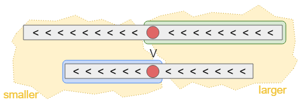

# Leetcode 4. Median of Two Arrays

[🔗 題目連結](https://leetcode.com/problems/median-of-two-sorted-arrays/)

:::note 題目敘述
給定兩個排序後的陣列 `nums1` 以及 `nums2`，請找出將兩陣列合併後的中位數。

比方說輸入為 $[1, 3, 5]$ 以及 $[2, 4, 6]$ 的時候，輸出為 $(3+4)/2=3.5$。
:::

## 解題思考

這題乍看之下與 Selection 極為相似。
但更棒的是，兩個陣列都已經分別排序了，所以如果我們不分青紅皂白地挑選兩個陣列中間的那個數字，相互比較的話，就能夠幫助我們無論如何都排除其中一個陣列將近一半的資料。



以上圖為例：在比較過兩排中央的紅色元素大小之後，我們便有機會移除「藍色底」或「綠色底」這兩個區塊的其中之一。要如何判斷藍底或綠底的區塊能被移除呢？這就要仰賴我們想找的第 $k$ 小數字的 "$k$" 的值啦。

首先，我們可以將所有數字劃分為兩群：smaller 以及 larger。如果 smaller 那群的數量至少有 $k$ 個這麼多，代表什麼呢？代表綠底的這些數字絕對不可能是答案（因為它們每個數字都大過於至少 $k$ 個數字），此時可以將之排除。如果 $k$ 比 smaller 來得大，這就意味著，在排序時，藍底的數字都會排在前 |smaller| 這麼多位，挑選第 $k$ 小的數字時，不可能選到任何一個藍底的數字，此時可以將之排除。

## 參考程式碼(C++)

```cpp
class Solution {
 public:
  int selection(vector<int>& A, int al, int ar,
                vector<int>& B, int bl, int br, int k /*範圍是 1 到 n*/) {
    // 邊界條件：如果有一邊已經空了，就用剩下的那個陣列回傳第 k 小的元素。
    if (al > ar) return B[bl + k - 1];
    if (bl > br) return A[al + k - 1];
    int n = ar - al + br - bl + 2;
    int am = (al + ar) / 2;
    int bm = (bl + br) / 2;
    int smaller = (am - al + bm - bl + 1);
    int larger = (ar - am + br - bm + 1);
    if (A[am] > B[bm]) {
      if (k <= smaller)
        return selection(A, al, am - 1, B, bl, br, k);
      else
        return selection(A, al, ar, B, bm + 1, br, k - (bm - bl + 1));
    } else {
      if (k <= smaller)
        return selection(A, al, ar, B, bl, bm - 1, k);
      else
        return selection(A, am + 1, ar, B, bl, br, k - (am - al + 1));
    }
  }

  double findMedianSortedArrays(vector<int>& nums1, vector<int>& nums2) {
    int n = nums1.size() + nums2.size();
    if (n % 2 == 0) {
      // 總數為偶數，找兩個數字並且回傳平均。
      int s1 = selection(nums1, 0, nums1.size() - 1,
                         nums2, 0, nums2.size() - 1, n/2);
      int s2 = selection(nums1, 0, nums1.size() - 1,
                         nums2, 0, nums2.size() - 1, n/2 + 1);
      return (s1 + s2) / 2.0;
    } else {
      // 總數為奇數，回傳中位數。
      int s = selection(nums1, 0, nums1.size() - 1,
                        nums2, 0, nums2.size() - 1, n/2 + 1);
      return s;
    }
  }
};
```

## 複雜度分析

每一次的遞迴呼叫，都讓至少一個陣列被砍了一半以上。因此遞迴重複的次數至多是 $O(\log |{\tt{nums}}_1| + \log |{\tt{nums}}_2|)$ 次。而每次函式呼叫所花的時間是常數，因此整體時間複雜度為 $O(\log |{\tt{nums}}_1| + \log |{\tt{nums}}_2|)$。

如果將遞迴改成純粹的迴圈，那麼需要的額外記憶體空間將僅有 $O(1)$。

## 備註/衍伸思考

1. 在 $n$ 為偶數情形下找出兩個數字並回傳平均，為了方便起見我們使用了兩次獨立的呼叫。要如何修改程式碼，使得效率提升到與只呼叫一次找數字接近？
2. 在 C++20 推出以後，可以利用 `span<int>` 來有效地表達一段連續的子陣列，有一點點接近 `string_view` 的味道。程式碼可以被改成多簡潔？
