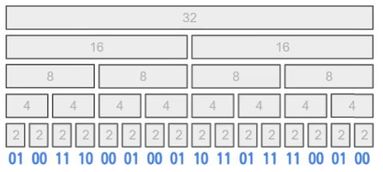

# 計算有效位元數量

:::note 計算有效位元數量 POPCOUNT
給定一個正整數 $x$，計算其寫成二進位時 $1$-bit 的數量。

例如輸入為 $x=21$ 時，輸出為 $3$。
:::

直接計算當然可以，我們可以透過重複找出 LSB 來求得答案。

```cpp
int popcount(int x) {
  int count = 0;
  while (x != 0) {
    x &= (x - 1);
    count++;
  }
  return count;
}
```

## 一個分而治之的想法

假設我們今天拿到的是一個 32-位元整數。那麼我們不難發現它的有效位元數量，等於前面較高的 16-位元部分的有效位元數量，加上後面較低的 16-位元部分的有效位元數量。因此我們可以「想像」出一個分而治之的方法：當我們有個 $n$-位元的整數時，我們總可以把它分成兩段 $(n/2)$-位元的整數，並將各自的有效位元數量加起來。



位元組計算厲害的地方是，從下而上的每一層，不需要分成數次遞迴，可以直接一口氣全部加起來！於是我們就得到以下適用於 32-bit 無號整數的計算方法：

```cpp
int popcount(uint32_t x) {
  x = (x & 0x55555555) + ((x>>1) & 0x55555555);
  x = (x & 0x33333333) + ((x>>2) & 0x33333333);
  x = (x & 0x0F0F0F0F) + ((x>>4) & 0x0F0F0F0F);
  x = (x & 0x00FF00FF) + ((x>>8) & 0x00FF00FF);
  x = (x & 0x0000FFFF) + ((x>>16) & 0x0000FFFF);
  return x;
}
```