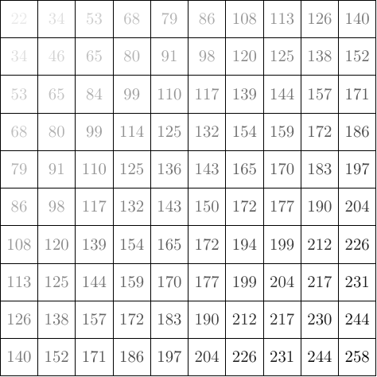
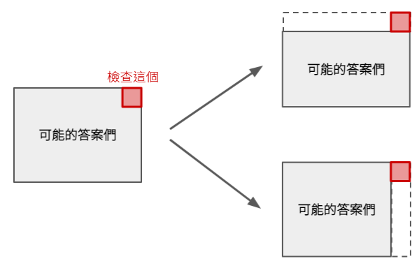

# 枚舉 Enumeration

「每一種可能性都嘗試看看」就是枚舉的本質。電腦解題比人腦解題上面一個非常巨大的優勢，就是可以機械式地檢查一個答案是不是正確的。

『既然電腦這麼厲害，那就全部都給電腦算就好了啊！』

上面這句話可以說是半對半錯。對的地方是，的確要跑出答案都是電腦計算、或者驗證出來的。錯誤的地方是，畢竟程式是人寫出來的（目前為止應該都還算是吧），要嘗試哪些可能的答案，也是身為程式設計師必須要事先想過的。

## 枚舉 vs. 暴力法

大家偶爾可以聽聞，某個題目可以用暴力方法（Brute Force）解決。又或者是，某道題目不屬於任何類別（Ad Hoc）。很多時候，其解法都是透過枚舉並逐一嘗試可能的答案所致。對於筆者來說，暴力方法解題的定義比較接近「思考量極少但確實是可行的解法」，因此枚舉往往是暴力法解題的方向之一。
然而，枚舉並不完全等於暴力法，在某些場合中，經過精心設計的枚舉，反而可以提升程式的效率。


:::tip 本單元的重點觀念
1. 想得越多，程式要做的事情就可以越少。
2. 藉由時間複雜度，來估算程式需要的執行時間。
:::

## 第一個例題：永遠的 Two Sum

Two Sum 這個問題就是軟體面試裡面的 Hello World。

:::note [Leetcode 1. Two Sum](https://leetcode.com/problems/two-sum/)
給你一個整數陣列 `nums` 以及一個整數 `target`，找出兩個註標 $i$ 和 $j$ 使得這兩個位置的整數加起來恰好是 `target`。

:::

### 方法 1. 很直接地枚舉

顯然，考慮所有的 $(i, j)$ 組合，就能夠幫助我們找到答案。

```cpp
// Leetcode 1. Attempt 1. C++ by tmt514
class Solution {
 public:
  vector<int> twoSum(vector<int>& nums, int target) {
    int n = nums.size();
    for (int i = 0; i < n; i++)
      for (int j = i + 1; j < n; j++)
        if (nums[i] + nums[j] == target)
          return {i, j};
    return {-1, -1};
  }
};
```

上面枚舉要考慮的情形，在最壞情況下所需要考慮的 $(i, j)$ 配對數為 $O(n^2)$ 的。

### 方法 2. 找出不必要的枚舉，忘枚舉可

想像一下，假設我們找到了 ${\texttt{nums}}[i] + {\texttt{nums}}[j] > target$。如果現在要考慮一個比 ${\tt{nums}}[i]$ 大的數字，與哪個數字搭配可以得到 $target$，那麼顯然與其搭配的數值必須要小於 ${\tt{nums}}[j]$ 才行！換句話說，如果我們能夠**先將陣列內的數字排序**，就有機會避免很多不必要的枚舉。

這個排序給了我們一個很大的提示：如果我們把所有 $n(n-1)/2$ 種組合繪製成一張表格。考慮以下範例：



我們可以從上面得到一個觀察：對於任何第 $i$ 列、第 $j$ 欄的格子 $(i, j)$ 來說，其左邊的格子 $(i, < j)$ 數值都比較小、其下方的格子 $(>i, j)$ 數值都比較大。

對於我們今天要找 $target$，如果從右上角開始看，**只要比較一次**就可以排除左邊的所有格子或下方的所有格子！於是我們可以用逐步排除的方法，減少不必要的枚舉量。



有了上面的觀察以後，我們就可以把它寫成程式碼啦！

```cpp
// Leetcode 1. Attempt 2. C++ by tmt514
class Solution {
 public:
  vector<int> twoSum(vector<int>& nums, int target) {
    // 先幫輸入的資料建立註標。
    vector<pair<int, int>> nums_with_index(nums.size());
    for (int i = 0; i < nums.size(); i++)
      nums_with_index[i] = {nums[i], i};

    // 帶有註標的排序。
    sort(nums_with_index.begin(), nums_with_index.end());
    
    // 從目前可能答案範圍的「右上角」逐步排除答案。
    int i = 0, j = nums_with_index.size() - 1;
    while (i < j) {
      int sum = nums_with_index[i].first + nums_with_index[j].first;
      if (sum == target)
        return {nums_with_index[i].second, nums_with_index[j].second};
      else if (sum < target)
        i++;
      else // sum > target
        j--;
    }
    return {-1, -1};
  }
};
```

由於 while 迴圈每一次執行後的 $j-i$ 的值總會越來越小，因此至多執行 $n$ 次。
於是，整個演算法的時間複雜度建立在 $O(n\log n)$ 時間的排序瓶頸上。 

### 方法 3. 利用已知資料結構來解題

枚舉了其中一個註標以後，我們有沒有什麼辦法可以快速找到 ${\tt{nums}}[j] = target - {\tt{nums}}[i]$ 呢？其實是可以的！
**判斷一個數字有沒有在集合內**是一個已知的問題，而且有已知的資料結構來幫助我們找出答案：我們只要將所有輸入的數值都丟到一個雜湊表裏面就行了！

```cpp
// Leetcode 1. Attempt 3. C++ by tmt514
class Solution {
 public:
  vector<int> twoSum(vector<int>& nums, int target) {
    // 我們利用 idx 來儲存數值->註標的對應。
    unordered_map<int, int> idx;

    // 枚舉所有的 i，然後看看有沒有之前存過的 j 滿足要求。
    for (int i = 0; i < nums.size(); i++) {
      if (idx.find(target - nums[i]) != idx.end()) {
        return {i, idx[target - nums[i]]};
      }
      // 然後把自己存進去。
      idx[nums[i]] = i;
    }

    return {-1, -1};
  }
};
```

這個方法的**期望**時間複雜度是 $O(n)$。

接下來我們就介紹幾個在枚舉方法中常見的幾個觀念和技巧吧！